# Object-Detection-with-GUI-base-on-Deep-Learning-Network

This is a program of matlab for object detection on deep learning

If using this code, please indicate the source and comply with the open source agreement!

Created by YangtseJin

如需转载或作其他用途，请注明出处！

project source code:https://github.com/yangtseJin/Object-Detection-with-GUI-base-on-Deep-Learning-Network

# Download Models

Download the pre-trained weight files

* [AlexNet_TransferLearning.mat](https://drive.google.com/file/d/1-1U-IleW1OTCWf8fv3-tex_Rj-BG2cXt/view?usp=drive_link)
* [maskrcnn_pretrained_person_car.mat](https://drive.google.com/file/d/1-4XO9DhA8RwEMhD55b5mWgDuYnOnb8P-/view?usp=drive_link)
* [YOLOv4-coco.mat](https://drive.google.com/file/d/1-5ye5V9AqLFrEs78_84kwjr52aNYp20B/view?usp=drive_link)

to the directry of `models` to start the program

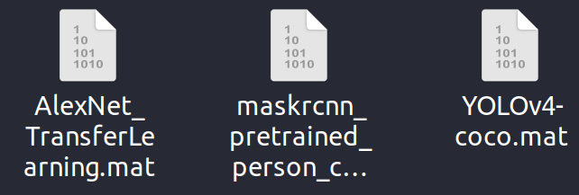

If necessary, you can set the read path yourself 

在使用本程序前，请下载预训练的权重文件，将它们放在 `models` 文件夹中

# 1 界面介绍

本程序实现了基于深度学习方法的目标检测，可以对图片和视频实现检测，并可视化检测到的结果，程序界面如下图所示。

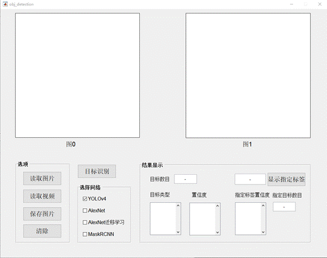

本程序支持四种深度学习模型的检测，分别为：

* YOLOv4模型
* AlexNet模型
* 基于AlexNet的迁移学习模型
* MaskRCNN模型。

建议Matlab版本为2021及以上，否则可能部分功能无法使用，同时还需要确保已经安装Deep Learning Toolbox和Computer Vision Toolbox，否则无法使用程序；若要使用AlexNet，请确保Matlab中的Deep Learning Toolbox经安装AlexNet,否则无法使用此模型。

程序中图0和图1所示位置为图片的显示区域；结果显示区域显示识别到的目标总个数、目标的类型和目标的置信度，同时还可以显示指定的目标，并显示指定的目标数目和置信度。

程序可以读取图片和视频，并且可以保存处理过的图片，清除按钮可以将程序初始化，即恢复原始状态。

# 2 图片识别

## 2.1 读入图片

点击读取图片按钮，选择要进行识别的图片，如下图所示。

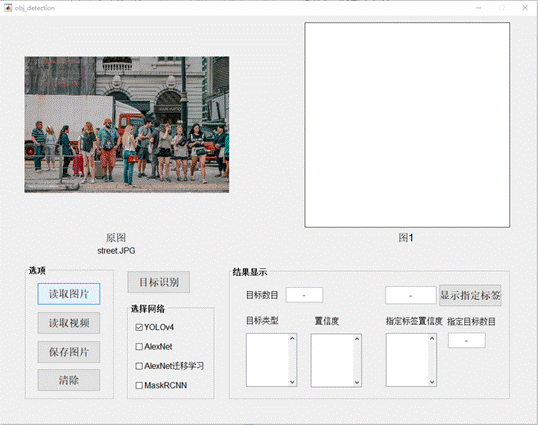

## 2.2 目标识别

读入图片后，点击目标识别按钮，程序识别到读入的是图片，对其进行识别，如下图所示，识别到的目标类别和置信度显示在下方的结果显示区域中，识别的结果下图所示。

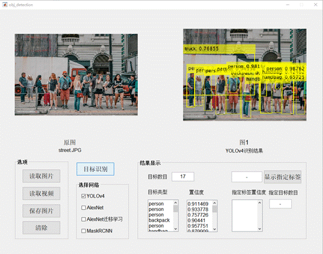

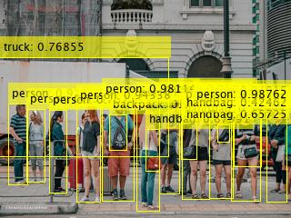

同时还可以选择其他的深度学习模型，如AlexNet模型、基于AlexNet的迁移学习模型和MaskRCNN模型，但AlexNet及其迁移学习模型只能对单张图片进行分类，无法达到YOLOv4的效果，结果下图所示。

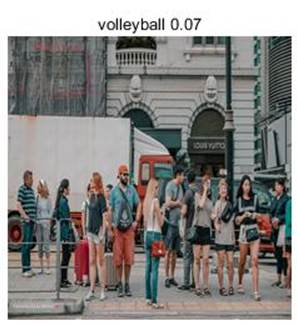

YOLOv4识别结果如下图所示

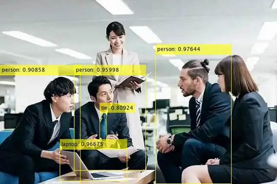

MaskRCNN模型识别结果如下图所示。

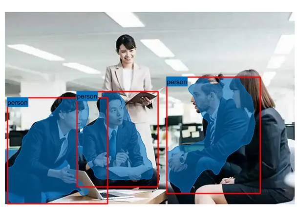

## 2.3 识别指定目标

输入指定目标的标签，并点击显示指定标签按钮，如输入handbag，并进行识别，识别结果如下图所示。

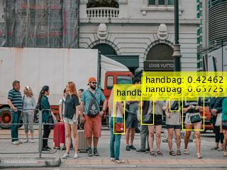

识别到的指定目标的置信度和总数目显示在目标显示区域，如下图所示。

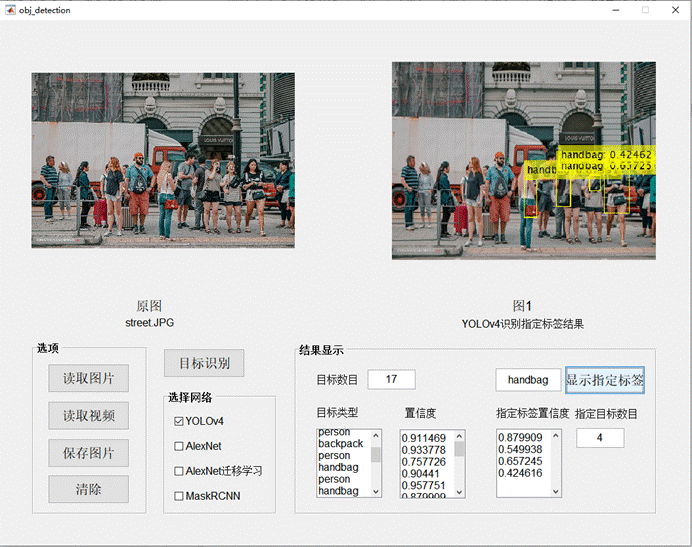

## 2.4 迁移学习

Matlab中的Deep Learning Toolbox带有AlexNet，安装Deep Learning Toolbox和AlexNet后可以直接调用AlexNet，但是AlexNet只能对单张图片做识别，且很多生活中常见的物品无法识别，原图如下图所示，

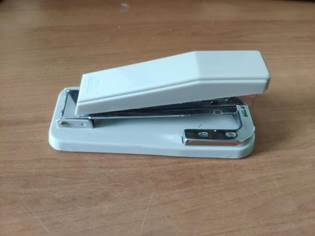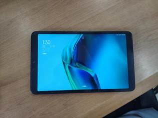

经AlexNet识别后结果如下图所示

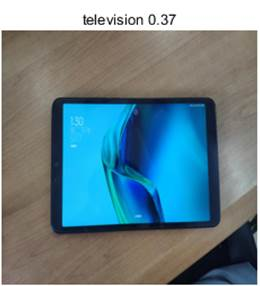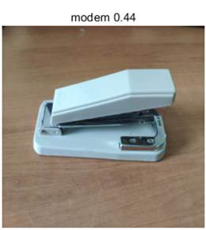

在对AlexNet做过迁移训练后，便可以识别这些物品，如下图所示。

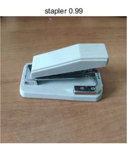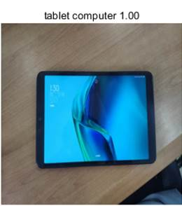

# 3 视频识别

## 3.1 读取视频

点击读取视频按钮，选择要读入的视频，读入的视频在程序中图0处播放，如下图所示。

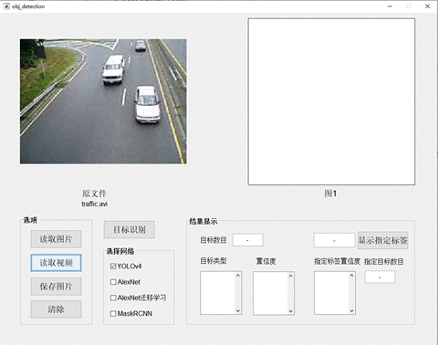

## 3.2 视频中的目标识别

点击目标识别，程序便会对视频中的目标进行识别，识别结果展示在图1位置处，并将识别到的物体类别和置信度显示在结果显示区域，如下图所示。

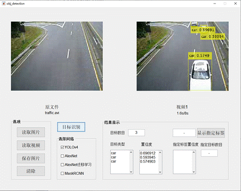

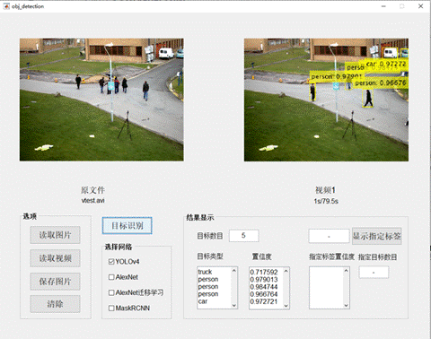
